# Gestalt: The Whole is Not the Sum of Its Parts

> *Can different combinations of parts produce the same whole?*

📄 **[Read the full article on Medium](https://suzume1.medium.com/gestalt-the-whole-is-not-the-sum-of-its-parts-a4e5f1c61ef1)**

---

## Overview

This experiment tests a compressive view of perception: that high-dimensional image space is reduced by the visual system into a smaller set of organized percepts, and that many distinct images can map onto the same perceptual region.

Concretely — can multiple independent optimization trajectories, starting from different random seeds, converge on the same visual structure when constrained by a shared target's structural organization, semantic content, and aesthetic response profile?

The answer, across five targets and fifteen trajectories, is yes.

---

## Approach

The experiment optimizes a **learnable delta in SD-Turbo's text embedding space** (unconditional embedding, no prompt required) to generate images that simultaneously match a target image along three independent dimensions:

| Signal | Model | What it captures |
|---|---|---|
| Structural organization | DINO ViT-S/8 | Spatial arrangement, edges, textures — independent of semantic content |
| Semantic content | CLIP ViT-L/14 | What the image depicts, categorical meaning |
| Aesthetic response | NIMA (AVA-trained) | The distributional shape of human aesthetic ratings (JSD against target's vote distribution) |

These are co-equal optimization objectives, not regularisers. Their weights are assigned dynamically using **multi-task uncertainty weighting** (Kendall & Gal, 2018).

---

## Three-Phase Training Curriculum

A key finding is that introducing all three losses simultaneously causes NIMA to stall — it plateaued at JSD 0.0109 by step 256 and stopped improving. This is because aesthetic gradients require an image that already has recognizable structure and content before they can usefully constrain anything.

The solution is a curriculum that respects perceptual dependencies:

```
Phase 1 (steps   1–100):  DINO only          — structural organization first
Phase 2 (steps 101–400):  DINO + CLIP        — semantic content enters once structure is established
Phase 3 (steps 401–3000): DINO + CLIP + NIMA — aesthetic refinement into a coherent basin
```

This ordering mirrors the dependency structure of visual processing itself: structural grouping before categorical identification, perceptual organization before aesthetic evaluation.

---

## Results

Five target images from the AVA dataset were selected, spanning different visual registers. Three independent trajectories were run per target (different random seeds, 3000 optimization steps each).

### Convergence metrics at step 3000

| Target | Description | DINO cosine dist | CLIP cosine dist | NIMA JSD range |
|---|---|---|---|---|
| 857228 | Gallery interior, figure and abstract painting | < 0.005 | 0.001–0.011 | 0.0079–0.0086 |
| 228928 | Sunset, dark grass silhouettes | < 0.005 | 0.001–0.011 | 0.0021–0.0030 |
| 33753 | Rural hillside, wooden fence posts | < 0.005 | 0.001–0.011 | 0.0052–0.0062 |
| 854398 | Dense red mineral crystals | < 0.005 | 0.001–0.011 | 0.0025–0.0032 |
| 518216 | Black-and-white portrait in grass | < 0.005 | 0.001–0.011 | 0.0042–0.0057 |

JSD ranges from 0 (perfect match) to 0.693 (maximum divergence). Contrastive verification confirmed that optimized images share structural organization with each other (mean DINO pairwise similarity ~0.99) compared to randomly sampled images with the same mean aesthetic score (0.05–0.13). The system is capturing something specific to each target's Gestalt, not simply producing high-quality images.

### Gestalt Grids — Image Evolution (3 seeds × 8 steps)

Each row is one trajectory. Columns are evenly sampled steps from initialization to step 3000. Three random starts; one organized whole.

| Target | Evolution |
|---|---|
| 228928 — Sunset | |
| 518216 — Portrait |  |
| 854398 — Minerals |  |
| 857228 — Gallery |  |

### UMAP Convergence Trajectories

Paths through DINO (structural) and CLIP (semantic) space from three random initializations to a shared target region. The star marks the target embedding.

| Target | UMAP |
|---|---|
| 228928 — Sunset | 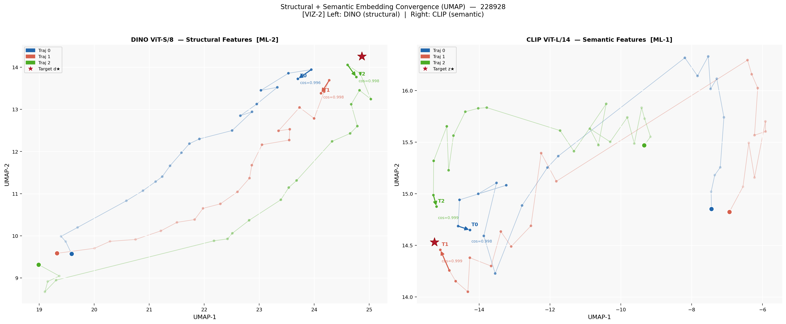 |
| 518216 — Portrait | 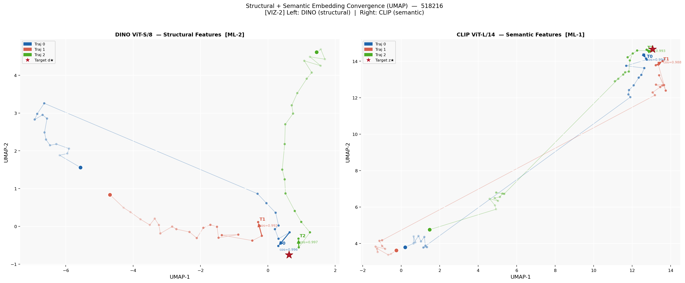 |
| 854398 — Minerals | 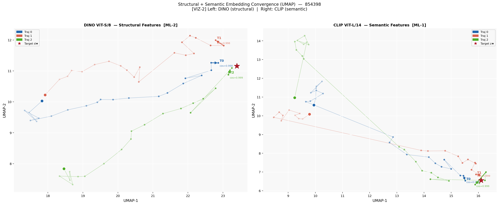 |
| 857228 — Gallery | 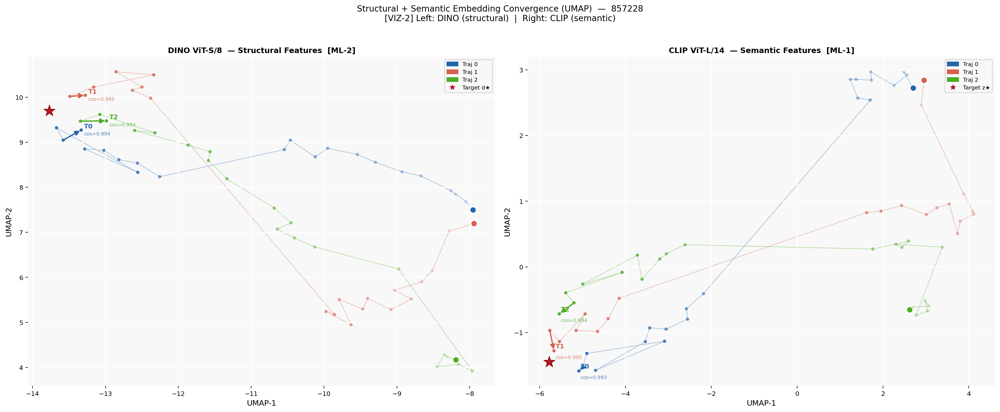 |

### Loss Curves

Three-phase curriculum visible in the shading: green = DINO warmup (steps 1–100), blue = DINO + CLIP (steps 101–400), unshaded = all three losses active.

| Target | Loss curves |
|---|---|
| 228928 — Sunset | 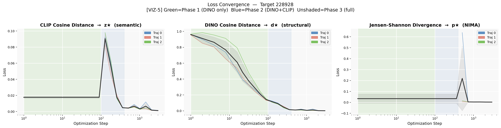 |
| 518216 — Portrait | 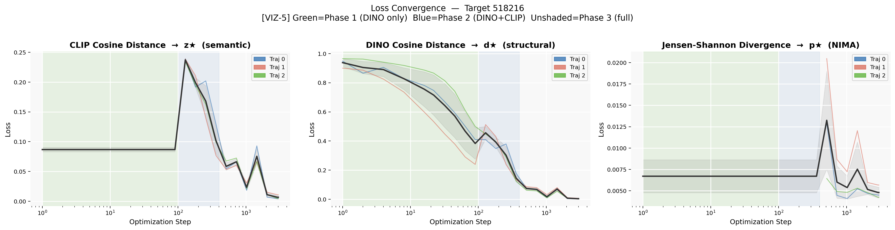 |
| 854398 — Minerals | 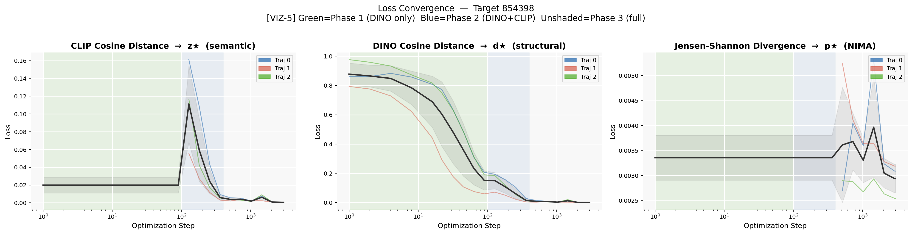 |
| 857228 — Gallery | 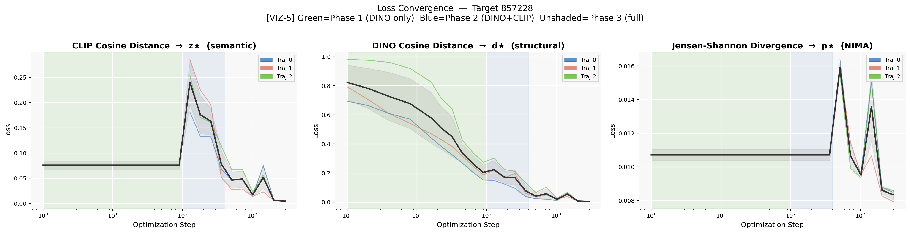 |

### NIMA Aesthetic Distribution Convergence

KDE ridge plots of predicted aesthetic distributions across training. Each trajectory narrows and shifts toward the red target curve by step 3000.

| Target | NIMA distributions |
|---|---|
| 228928 — Sunset | 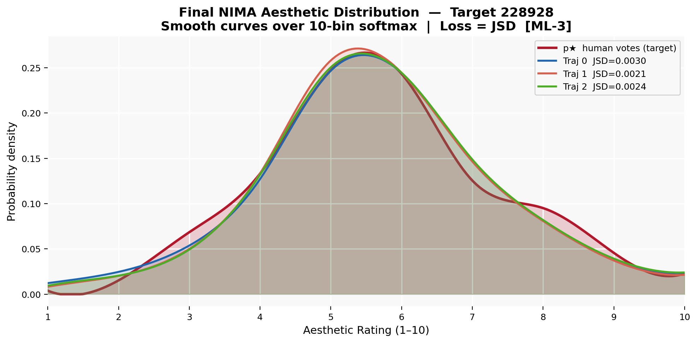 |
| 518216 — Portrait | 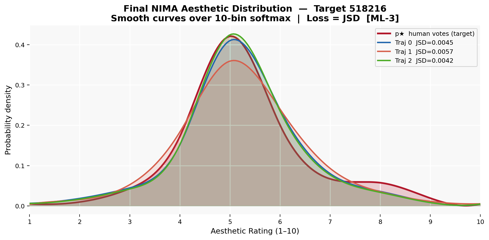 |
| 854398 — Minerals | 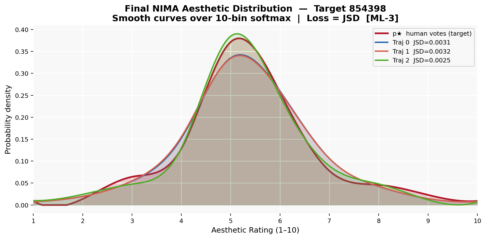 |
| 857228 — Gallery | 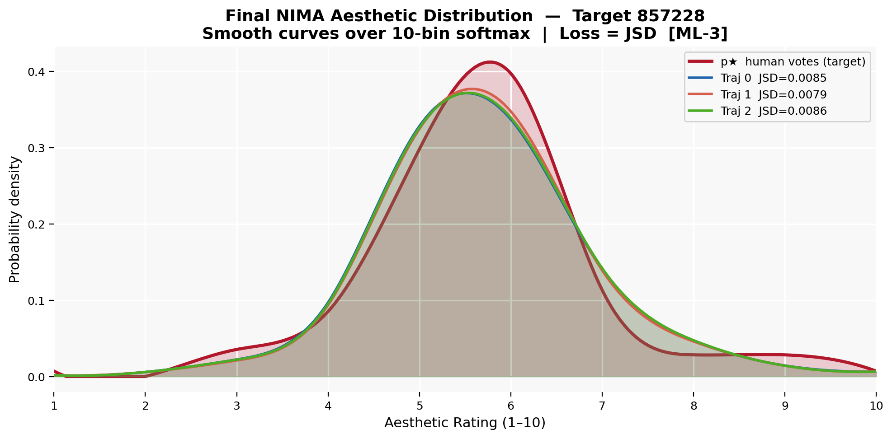 |

---

## Contrastive Verification

To rule out the hypothesis that convergence reflects general aesthetic quality rather than target-specific structure, optimized images were compared against randomly sampled AVA images with the same mean aesthetic score as each target.

All five targets supported the hypothesis. Optimized images are significantly more similar to each other (DINO ~0.99, LPIPS 0.55–0.70) than same-score random images (DINO 0.05–0.13, LPIPS 0.75–0.90).

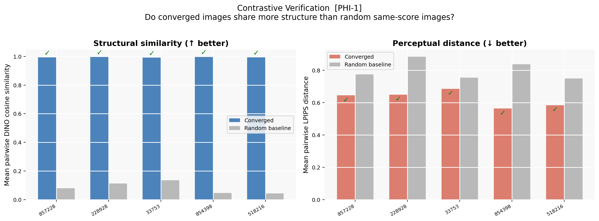

---

## Models and Dependencies

```
stabilityai/sd-turbo        — image generation via text embedding optimization
openai/clip ViT-L/14        — semantic similarity (open_clip_torch)
facebookresearch/dino ViT-S/8 — structural similarity
pyiqa NIMA (AVA-trained)    — aesthetic distribution prediction
lpips (AlexNet)             — perceptual similarity for contrastive verification
umap-learn                  — trajectory visualization
```

**Python dependencies** (full list in notebook cell 1):
```
diffusers>=0.26.0, transformers>=4.37.0, accelerate>=0.26.0,
open_clip_torch>=2.24.0, torch>=2.1.0, torchvision>=0.16.0,
pyiqa>=0.1.9, lpips>=0.1.4, umap-learn>=0.5.5, scipy>=1.11.0
```

**Hardware:** Designed to run on Kaggle with dual T4 GPUs. Single GPU is supported (the experiment parallelises trajectories across devices when available).

---

## Data

The experiment uses the **AVA (Aesthetic Visual Analysis) dataset**, which provides 255,000+ images with human aesthetic ratings from 1–10 (typically ~200 votes per image). The normalized vote distribution (10-bin) is used directly as the NIMA optimization target.

Dataset: [AVA on Kaggle](https://www.kaggle.com/datasets/nicolacarrassi/ava-aesthetic-visual-assessment)

Target image IDs used in this experiment: `857228`, `228928`, `33753`, `854398`, `518216`

---

## Repository Structure

```
gestalt.ipynb                        — full experiment notebook (v9.0)
results/
  ├── config.json                    — full experiment configuration
  ├── all_logs.json                  — per-step loss and embedding logs for all trajectories
  ├── summary.csv                    — final metrics across all targets and seeds
  ├── contrastive_verification.csv   — DINO and LPIPS scores: converged vs. random baseline
  ├── contrastive_verification.png   — summary chart of contrastive verification results
  │
  ├── 228928/                        — sunset, dark grass silhouettes
  │   ├── gestalt_grid.png           — image evolution across 8 sampled steps × 3 seeds
  │   ├── umap_convergence.png       — CLIP + DINO UMAP trajectory plots
  │   ├── loss_curves.png            — DINO, CLIP, and NIMA losses across 3000 steps
  │   ├── kde_evolution.png          — aesthetic distribution evolution per trajectory
  │   ├── nima_distributions.png     — final NIMA distributions vs. target
  │   ├── weight_curves.png          — uncertainty-weighted task weights over training
  │   ├── gradient_diagnostics.png   — per-task gradient norms and CLIP-DINO alignment
  │   └── lr_schedule.png            — cosine warm restart learning rate schedule
  │
  ├── 518216/                        — black-and-white portrait in grass
  ├── 854398/                        — dense red mineral crystals
  └── 857228/                        — gallery interior, figure and abstract painting
      └── (same structure as above)
```

Each per-target folder contains the same eight visualizations. The root `results/` level holds the cross-target summary data and contrastive verification output.

---

## Notebook Version History

The notebook is version **v9.0** and includes a complete technical changelog. Key architectural decisions across versions:

- **v8.0:** DINO-only warmup (OPT-1), DINO weight floor in uncertainty weighting (OPT-2), text embedding delta optimization replacing noise latent optimization (ML-4), extended gestalt grid to 8 intermediate steps (VIZ-4)
- **v9.0:** Three-phase curriculum (OPT-3), NIMA sigma floor lowered 0.45 → 0.30 (CFG-4), two-band warmup visualization (VIZ-5), phase-aware uncertainty weighting that avoids pre-adapting NIMA sigma before phase 3 (CODE-1)

---

## Key Design Decisions

**Why text embedding space, not noise latents?**
Optimizing noise latents is unstable — small changes produce large, discontinuous shifts in the generated image. Text embedding deltas provide a smoother optimization landscape with more consistent gradients.

**Why DINO and not just CLIP?**
CLIP encodes semantic content. Gestalt operates at the level of structural organization — spatial grouping, edge arrangements, figure-ground relationships — which is prior to semantic interpretation. DINO, trained without category labels, encodes this structural dimension. Both are needed.

**Why JSD instead of KL for NIMA?**
Jensen-Shannon divergence is symmetric and numerically better behaved than KL divergence when comparing probability distributions with near-zero bins, which is common in sparse AVA vote distributions.

---

## Acknowledgements

Built on the [AVA dataset](https://arxiv.org/abs/1204.0580), [SD-Turbo](https://arxiv.org/abs/2311.17042), [OpenCLIP](https://github.com/mlfoundations/open_clip), [DINO](https://arxiv.org/abs/2104.14294), [NIMA](https://arxiv.org/abs/1709.05424), and the uncertainty weighting scheme from [Kendall & Gal (2018)](https://arxiv.org/abs/1705.07115).

---

*Written by [Suzume](https://x.com/Suzume322394) · [GitHub](https://github.com/suzume-hue)*
